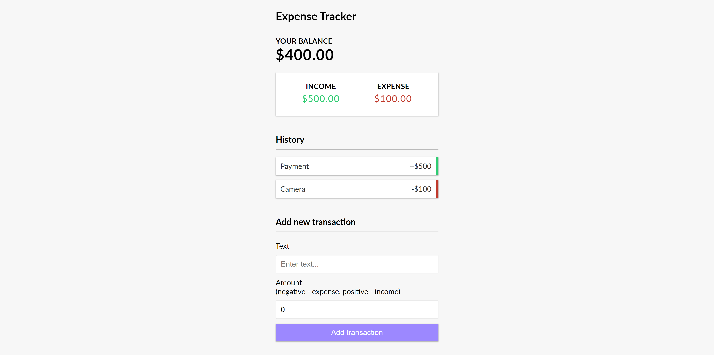

# expense-tracker

This is a MERN stack application from the Brad Traversy YouTube Channel "Node.js & Express API | Expense Tracker". It is a simple expense tracker that allows input of transactions from the client and keeps it in a MongoDB database.

## Quick Start

### Inside the config folder, create a file called config.env with the following:

```
{
    NODE_ENV=production
    PORT=5000
    MONGO_URI=YOUR_DATABASE_URI
}
```

### Install server dependencies

```
npm install
```

### Install client dependencies

```
cd client
npm install
```

### Run both Front and Backend from root

```
npm run dev
```

### Run Frontend only

```
npm run client
```

### Run Backend only

```
npm run server
```

### Build client for production

```
cd client
npm run build
```

### Run For Production

```
npm start
```

## Screenshots


